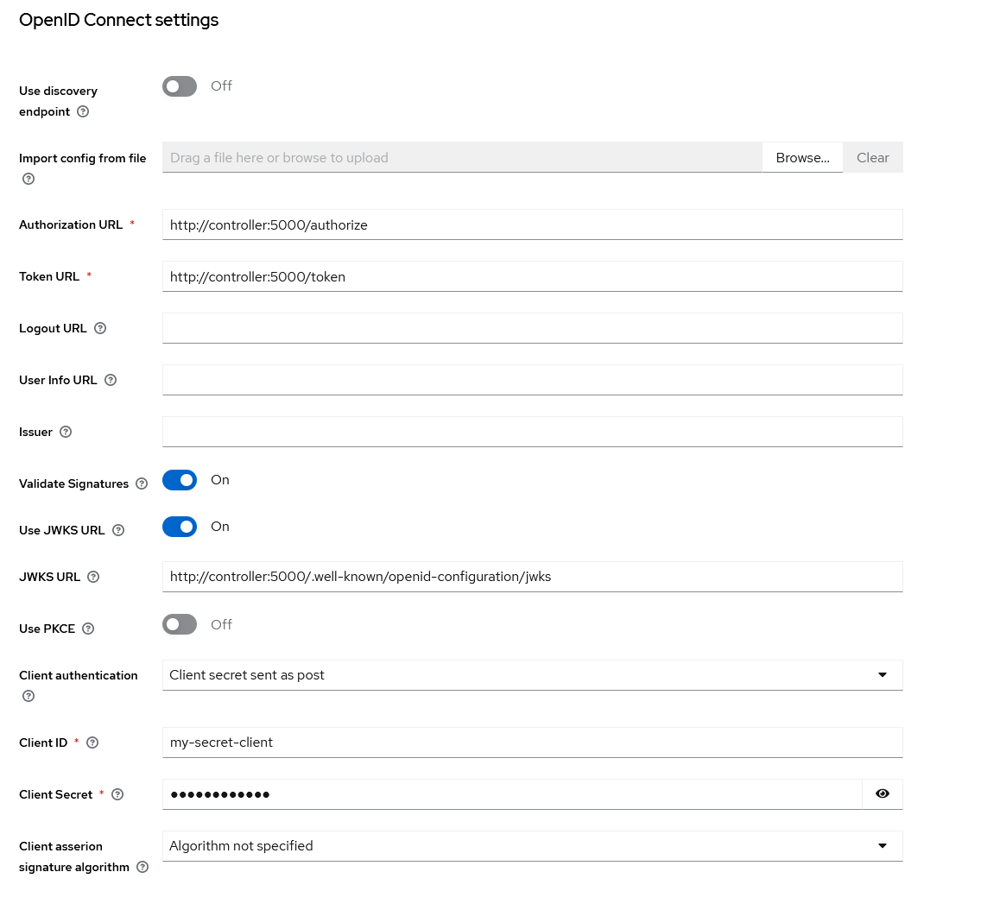
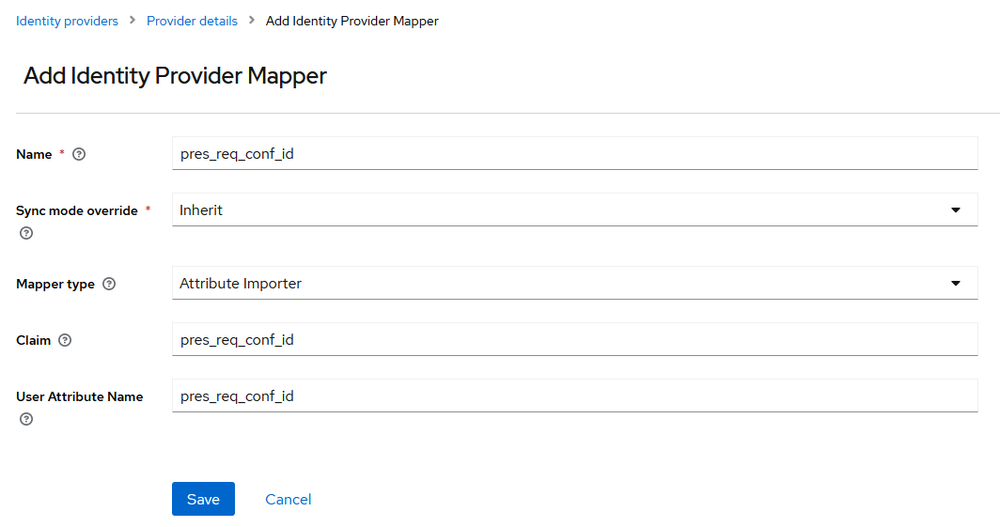

# Configuration Guide

## Using an Access and Identity Management Broker

### Adding VC Authn as Identity Provider

The first step is to add VC Authn as a new Identity Provider for our AIM system. The following instructions are built for Keycloak, but should be applicable for any AIM that supports Open ID Connect.

1. Click on the **Identity Providers** tab and select **Open ID Connect v1.0** from the **User-defined** section.
   

2. In the next page, select an alias and a display name for your Idp. The alias will be used to generate a unique URL corresponding to the new provider, while the display name will be used in the Keycloak login screen on the button corresponding to the IdP.
   

3. We will now configure the Open Id Connect parameters for our new provider.

[!NOTE]
VC-AuthN exposes the `.well-known/openid-configuration` endpoint to provide systems that support it automatic discovery of the endpoints and features of the Identity Provider. If you decide to do so, switch on **Use discovery endpoint** and enter `{VC_AUTHN_PUBLIC_URL}/.well-known/openid-configuration` to proceed.

To input settings manually, or review them:

- **Authorization URL**: this must be set to `{PUBLIC_VC_AUTHN_URL}/authorize`

- **Token URL**: this must be set to `{PUBLIC_VC_AUTHN_URL}/token`

- **DIsable User Info**: it is recommended to disable the user info endpoint, since VC Authn does not store/provide user information.

- **Client ID/Client Secret**: these settings will be used to identify and secure the IdP integration between Keycloak and VC Authn. Make sure the **client secret** parameter is unique to your VC Authn instance. VC-AuthN supports two methods of client authentication: `Client secret sent as basic auth` and `Client secret sent as post`.

- **Default Scopes**: this must be set to `vc_authn` to instruct the AIM broker which scopes to request from the IdP.

- **Validate Signatures**: if you want to have the signature of VC-AuthN validated by Keycloak, turn this on, flip the `Use JWKS URL` to true and set `JWKS URL` to `{PUBLIC_VC_AUTHN_URL}/.well-known/openid-configuration/jwks`.

- **Forwarded Query Parameters**: set this to `pres_req_conf_id`. This parameter is used by VC Authn to lookup in its database the configuration to generate presentation request to be displayed to the user and the AIM system needs to forward it when initiating the authentication.



Save the settings and take note of the generated **Redirect URI** and **Client ID/Secret** parameters, they will be usd in the next steps.

### Configuring VC Authn

VC-AuthN can be configured by using the API endpoints exposed on Swagger at `VC_AUTHN_PUBLIC_URL}/docs`. The `oidc_clients` namespace provides RESTful APIs to create/delete/update clients.

To register a new client, `POST` a request to the `/clients` endpoint with a payload containing the client id/secret and redirect URL noted at the previous step. Example:

```json
{
  "client_id": "my-new-client",
  "client_name": "my-keycloak",
  "client_secret": "super-secret",
  "response_types": ["code", "id_token", "token"],
  "token_endpoint_auth_method": "client_secret_post",
  "redirect_uris": [
    "http://localhost:8880/auth/realms/vc-authn/broker/vc-authn/endpoint"
  ]
}
```

### Mappers

Once the new Identity Provider is configured, mappers should be added in order to consume the claims in issued tokens. This can be done by clicking `Add mapper` in the `Mappers` tab within the Identity Provider configuration view. Mappers should be configured using the type `Attribute Importer` and, at minimum, should include:

- `pres_req_conf_id`: this will return the id of the proof request configuration that was used during the authentication request. It should be used by the client application to check authentication was completed by using the expected credential (see [best bractices](./BestPractices.md) for additional information).
- `vc_presented_attributes`: this will contain a serialized JSON object containing all of the attributes requested as part of the proof request, for the application to consume. If individual mappers are preferred, they can be configured to extract individual claims.

The following is an example mapper configuration:


## Direct Configuration

VC-AuthN 2.0 only supports confidential clients, and cannot be configured to be invoked directly from Single-Page applications. For back-end systems, however, the above instructions should still apply.

## Environment Variables

Several functions in VC-AuthN can be tweaked by using the following environment variables.

| Variable                  | Type                                   | What it does                                                                                                                                                                                                                                                                                                                                                                                                                                           | NOTES                                                                                                                                   |
| ------------------------- | -------------------------------------- | ------------------------------------------------------------------------------------------------------------------------------------------------------------------------------------------------------------------------------------------------------------------------------------------------------------------------------------------------------------------------------------------------------------------------------------------------------ | --------------------------------------------------------------------------------------------------------------------------------------- |
| SET_NON_REVOKED           | bool                                   | if True, the `non_revoked` attributed will be added to each of the present-proof request `requested_attribute` and `requested_predicate` with 'from=0' and'to=`int(time.time())`                                                                                                                                                                                                                                                                       |                                                                                                                                         |
| USE_OOB_PRESENT_PROOF     | bool                                   | if True, the present-proof request will be provided as a an [out of band](https://github.com/hyperledger/aries-rfcs/tree/main/features/0434-outofband) invitation with a [present-proof](https://github.com/hyperledger/aries-rfcs/tree/main/features/0037-present-proof) request inside. If False, the present-proof request will be use the [service-decorator](https://github.com/hyperledger/aries-rfcs/tree/main/features/0056-service-decorator) | **TRUE:** Hologram Wallet supports our OOB Message with a minor glitch, BiFold, Lissi, Trinsic, and Estatus all read the QR code as 'Invalid' |
| USE_OOB_LOCAL_DID_SERVICE | bool                                   | Instructs VC-AuthN to use a local DID, it must be used when the agent service is not registered on the ledger with a public DID                                                                                                                                                                                                                                                                                                                        | Use this when `ACAPY_WALLET_LOCAL_DID` is set to `true` in the agent.                                                                   |
| LOG_WITH_JSON             | bool                                   | If True, logging output should printed as JSON if False it will be pretty printed.                                                                                                                                                                                                                                                                                                                                                                     | Default behavior will print as JSON.                                                                                                    |
| LOG_TIMESTAMP_FORMAT      | string                                 | determines the timestamp formatting used in logs                                                                                                                                                                                                                                                                                                                                                                                                       | Default is "iso"                                                                                                                        |
| LOG_LEVEL                 | "DEBUG", "INFO", "WARNING", or "ERROR" | sets the minimum log level that will be printed to standard out                                                                                                                                                                                                                                                                                                                                                                                        | Defaults to DEBUG                                                                                                                       |

## Proof Request Configuration Options

The basic structure of a proof-request configuration is described [here](README.md#data-model). Additional options are described via the Swagger document, and listed below:

- `include_v1_attributes`: defaults to `false`, switch to `true` if root-level claims as presented in VC-AuthN v1 are still required for the proof-request.
